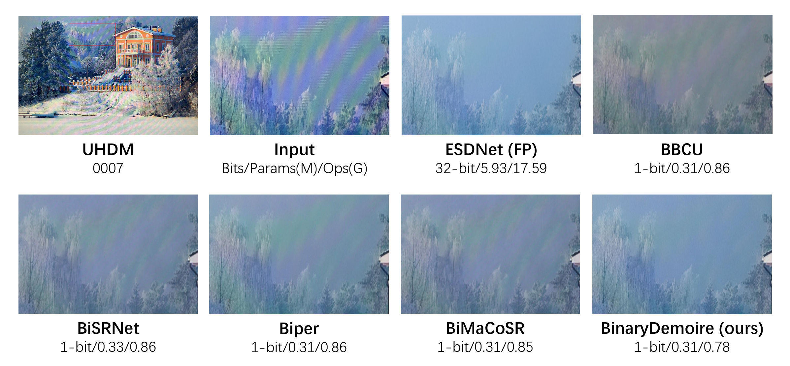
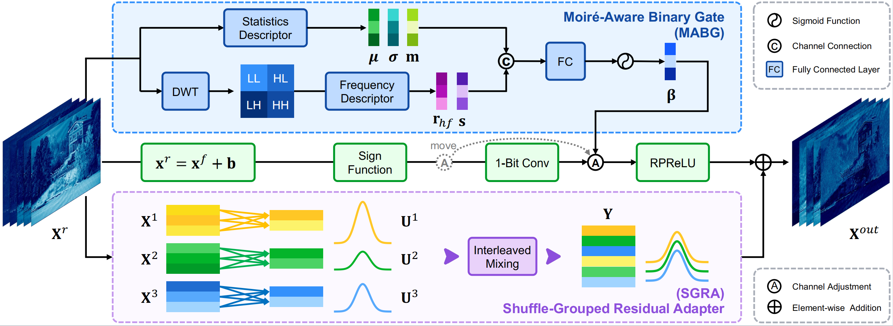

# BinaryDemoire: Moiré-Aware Binarization for Image Demoiréing

[Zheng Chen](https://zhengchen1999.github.io/), [Zhi Yang](https://github.com/yandzhi), [Xiaoyang Liu](https://xyliu339.github.io/), [Weihang Zhang](), [Mengfan Wang](), [Yifan Fu](), [Linghe Kong](), [Yulun Zhang](http://yulunzhang.com/),"BinaryDemoire: Moiré-Aware Binarization for Image Demoiréing", arXiv, 2026

<div>
<a href="https://github.com/zhengchen1999/BinaryDemoire/releases" target='_blank' style="text-decoration: none;"></a>
<a href="https://github.com/zhengchen1999/BinaryDemoire" target='_blank' style="text-decoration: none;"></a>
<a href="https://github.com/zhengchen1999/BinaryDemoire/stargazers" target='_blank' style="text-decoration: none;"></a>
</div>

[[arXiv](https://arxiv.org/abs/2510.04066)] [[supplementary material](https://github.com/zhengchen1999/BinaryDemoire/releases/download/v1/Supplementary_Material.pdf)] [[project](https://zheng-chen.cn/BinaryDemoire/)]

#### 🔥🔥🔥 News

- **2025-02-04:** This repo is released.

---

> **Abstract:** Image demoiréing aims to remove structured moiré artifacts in recaptured imagery, where degradations are highly frequency-dependent and vary across scales and directions. While recent deep networks achieve high-quality restoration, their full-precision designs remain costly for deployment. Binarization offers an extreme compression regime by quantizing both activations and weights to 1-bit. Yet, it has been rarely studied for demoiréing and performs poorly when naively applied. In this work, we propose **BinaryDemoire**, a binarized demoiréing framework that explicitly accommodates the frequency structure of moiré degradations. First, we introduce a moiré-aware binary gate (MABG) that extracts lightweight frequency descriptors together with activation statistics. It predicts channel-wise gating coefficients to condition the aggregation of binary convolution responses. Second, we design a shuffle-grouped residual adapter (SGRA) that performs structured sparse shortcut alignment. It further integrates interleaved mixing to promote information exchange across different channel partitions. Extensive experiments on four benchmarks demonstrate that the proposed BinaryDemoire outperforms the state-of-the-art binarization methods.



## ⚒️ TODO

* [ ] Release code and pretrained models
* [ ] Test our binarization method on more models

## 🔎 Method Overview



## <a name="results"></a>🔎 Results

<details open>
<summary>Quantitative Results (click to expand)</summary>

- Results in Tab. 2 of the main paper

<p align="center">
  
</p>

<details open>
<summary>Qualitative Results (click to expand)</summary>

- Results in Fig. 7 of the main paper

<p align="center">
  
</p>
<details>
<summary>More Qualitative Results</summary>

- More results in Fig. 2 of the supplementary material

<p align="center">
  
</p>
</details>

## <a name="citation"></a>📎 Citation

If you find the code helpful in your research or work, please cite our work.

```
@inproceedings{chen2026binarydemoire,
    title={BinaryDemoire: Moiré-Aware Binarization for Image Demoiréing},
    author={Chen, Zheng and Zhang, Kewei and Liu, Xiaoyang and Zhang, Weihang and Wang, Mengfan and Fu, Yifan, and Kong, Linghe and Zhang, Yulun},
    journal={},
    year={2026}
}
```


## <a name="acknowledgements"></a>💡 Acknowledgements

This project is based on [ESDNet](https://github.com/CVMI-Lab/UHDM), [BBCU](https://github.com/Zj-BinXia/BBCU), and [Bi-DiffSR](https://github.com/zhengchen1999/BI-DiffSR).